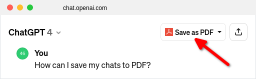

# Save ChatGPT as PDF

## Introduction

"Save ChatGPT as PDF" is a tool that adds a button to the ChatGPT webpage and allows you to save your chats to PDF in one click. It is available as a browser extension or a user script. The tool uses [PDFCrowd API](https://pdfcrowd.com/api/html-to-pdf-api/) to create PDF.

## Installation

### Browser Extension

Install the extension for [Firefox](https://addons.mozilla.org/en-US/firefox/addon/save-chatgpt-as-pdf/) or [Google Chrome](#).

In Chrome it should start working automatically.

In Firefox click on the extension icon or enable Always Allow on chat.openai.com.

### User Script

1. **Install a user script manager**:
   If you haven't already, you need to install a user script manager. 
   - [Tampermonkey](https://www.tampermonkey.net/) - Chrome, Firefox, Safari, Microsoft Edge, Opera
   - [Violentmonkey](https://violentmonkey.github.io/) - Chrome, Firefox, Microosft Edge, Opera
   - [Greasemonkey](https://addons.mozilla.org/en-US/firefox/addon/greasemonkey/) - Firefox

2. **Install the user script**:
   click [here](https://greasyfork.org/en/scripts/484463-save-chatgpt-as-pdf).

Once you've installed and enabled the user script, it should start working automatically.

## Links

PDFCrowd:
 <https://pdfcrowd.com/save-chatgpt-as-pdf/>

Project homepage at GitHub:
 <https://github.com/pdfcrowd/save-chatgpt-as-pdf/>

## License

This project is licensed under the [MIT License](LICENSE).
